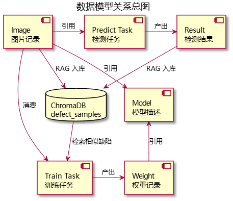

# Ommateum 数据模型设计

> 通用视觉缺陷检测平台 — 运行时内存模型 × 持久化存储模型

---

## 一、概述

Ommateum 的数据模型分为两个层面：

- **运行时内存模型** — API 层以轻量级 `dict` 结构管理，生产环境可平滑迁移至 Pydantic 或 ORM
- **持久化文件模型** — YOLO 标注格式（txt）、SAM2 掩码格式（png）、ChromaDB 向量文档

---

## 二、运行时内存模型

### 2.1 图片记录 (Image Record)

上传的待检测图片元数据，存储在 `IMAGES: dict[str, dict]`。

| 字段 | 类型 | 说明 |
|---|---|---|
| `id` | `str` | 唯一标识，`img_` + 12 位 hex |
| `name` | `str` | 原始文件名 |
| `type` | `str` | `"normal"` (正常) 或 `"defect"` (缺陷) |
| `url` | `str` | 文件访问路径 `/api/files/{type}/{filename}` |
| `size_kb` | `float` | 文件大小 (KB) |
| `width` | `int` | 图片宽度 (像素) |
| `height` | `int` | 图片高度 (像素) |
| `model` | `str` | 关联模型 ID |
| `weight` | `str` | 关联权重 ID |
| `uploaded_at` | `str` | ISO 8601 UTC 上传时间 |

**关联关系：** 被 Predict Task、Training Task 引用作为输入；通过 `_store_in_rag()` 写入 ChromaDB。

---

### 2.2 模型描述 (Model Record)

可用检测/分割模型的元数据，静态定义。

| 字段 | 类型 | 示例值 | 说明 |
|---|---|---|---|
| `id` | `str` | `"yolov11"` | 模型唯一 ID |
| `name` | `str` | `"YOLOv11"` | 显示名称 |
| `description` | `str` | `"Ultralytics YOLOv11 缺陷检测模型"` | 描述 |
| `architecture` | `str` | `"Ultralytics YOLOv11"` | 底层架构 |
| `input_size` | `list[int]` | `[640, 640]` | 模型输入尺寸 |

**关联关系：** 每个 Image 和 Weight 记录关联一个 Model ID。

---

### 2.3 权重记录 (Weight Record)

分为预置权重 (`PRESET_WEIGHTS`) 和训练产出 (`TRAINED_WEIGHTS`) 两类。

| 字段 | 类型 | 说明 |
|---|---|---|
| `id` | `str` | 权重唯一标识；预置如 `"yolo11n"`，训练产出如 `"trained_xxx"` |
| `name` | `str` | 显示名称 |
| `size_mb` | `float` | 文件大小 (MB) |
| `accuracy` | `float` | 精度指标 |
| `trained` | `bool` | 是否为用户训练产出 |

**训练产出额外字段：**

| 字段 | 类型 | 说明 |
|---|---|---|
| `dataset` | `str` | 训练数据集描述 |
| `task_id` | `str` | 关联训练任务 ID |
| `epochs` | `int` | 训练轮数 |
| `lr` | `float` | 学习率 |
| `path` | `str` | 权重文件绝对路径 |
| `created_at` | `str` | ISO 8601 创建时间 |

**关联关系：** 关联 Model ID 和 Training Task ID；预测时被 Inference Server 加载。

---

### 2.4 检测任务记录 (Predict Task Record)

单次批量推理的任务状态与结果，存储在 `TASKS: dict[str, dict]`。

| 字段 | 类型 | 说明 |
|---|---|---|
| `id` | `str` | 任务 ID，`task_` + 12 位 hex |
| `status` | `str` | `"running"` / `"done"` / `"error"` |
| `model` | `str` | 使用的模型 ID |
| `weight` | `str` | 使用的权重 ID |
| `image_ids` | `list[str]` | 参与检测的图片 ID 列表 |
| `results` | `list[dict]` | 每张图片的检测结果数组 |
| `summary` | `dict` | 汇总统计 |
| `created_at` | `str` | ISO 8601 创建时间 |
| `completed_at` | `str` | ISO 8601 完成时间 |

**单张结果条目 (`results[i]`) 结构：**

| 字段 | 类型 | 说明 |
|---|---|---|
| `image_id` | `str` | 关联图片 ID |
| `image_name` | `str` | 原始文件名 |
| `expected_verdict` | `str` | 标注期望结果 |
| `verdict` | `str` | 模型判定结果 `"defect"` / `"normal"` |
| `confidence` | `float` | 置信度 0-1 |
| `severity` | `str` | 缺陷严重程度 `"minor"` / `"major"` / `"critical"` |
| `defect_type` | `str` | 缺陷类别名称 |
| `model` | `str` | 推理使用的模型 ID |
| `weight` | `str` | 推理使用的权重 ID |
| `processing_ms` | `int` | 单张推理耗时 (ms) |
| `score_map_url` | `str \| null` | 热力图访问路径 |

**关联关系：** 引用 Image、Model、Weight 记录；预测完成后将结果写入 ChromaDB。

---

### 2.5 训练任务记录 (Training Task Record)

单次训练任务的状态与指标，存储在 `TRAINING_TASKS: dict[str, dict]`。

| 字段 | 类型 | 说明 |
|---|---|---|
| `id` | `str` | 任务 ID，`train_` + 12 位 hex |
| `status` | `str` | `"training"` / `"done"` / `"error"` |
| `model` | `str` | 使用的预训练模型 (如 `"yolo11n.pt"`) |
| `epochs` | `int` | YOLO 训练轮数 |
| `lr` | `float` | YOLO 学习率 |
| `normal_count` | `int` | 正常样本数 |
| `defect_count` | `int` | 缺陷样本数 |
| `current_epoch` | `int` | 当前 epoch (实时更新) |
| `progress` | `float` | 训练进度 0.0-1.0 |
| `stage` | `str` | 当前阶段描述 |
| `loss` | `float` | 当前训练损失 |
| `val_loss` | `float` | 验证损失 |
| `accuracy` | `float` | 当前精度 |
| `metrics` | `list` | 历史指标序列 |
| `weight_id` | `str \| null` | 训练完成后产出的权重 ID |
| `final_accuracy` | `float \| null` | 最终精度 |
| `started_at` | `str` | ISO 8601 开始时间 |
| `completed_at` | `str` | ISO 8601 完成时间 |
| `error` | `str \| null` | 错误信息 (status=error 时) |

**关联关系：** 产出 Weight Record；消费 Image 数据构建训练集。

---

## 三、持久化存储模型

### 3.1 YOLO 标注格式 (Label File)

每条标注为一个 `.txt` 文件，与同名 `.jpg` 图片一一对应：

```
# 每行一个目标：class_id cx cy w h
# class_id: 缺陷类别索引 (0 起)
# cx, cy:   归一化中心坐标 (0-1)
# w, h:     归一化宽高 (0-1)

0 0.5234 0.6875 0.1562 0.0938   # 类别 0 (如 scratch)
1 0.3200 0.4500 0.0890 0.1200   # 类别 1 (如 dent)
```

**数据集目录约定（Ultralytics YOLO 标准格式）：**

```
dataset/
  images/
    train/   ← 训练图片 (jpg)
    val/     ← 验证图片 (jpg)
  labels/
    train/   ← 训练标注 (txt) — YOLO 自动从 images/ 映射
    val/     ← 验证标注 (txt)
  dataset.yaml  ← 数据集配置 (path, train, val, nc, names)
```

> YOLO 自动将 `train: images/train` 中的 `images` 替换为 `labels` 来定位标注文件，无需在 yaml 中单独声明 labels 路径。

**`dataset.yaml` 示例：**

```yaml
path: /Ommateum/dataset/severstal_yolo
train: images/train
val: images/val
nc: 2
names: ["scratch", "dent"]
```

---

### 3.2 SAM2 掩码格式 (Mask Directory)

分割训练所需的 pixel-level 标注，与 YOLO 标注配合使用：

```
mask_dir/
  img_001_mask_0.png   # 第 0 个 bbox 对应的分割掩码
  img_001_mask_1.png   # 第 1 个 bbox 对应的分割掩码
  img_002_mask_0.png
  ...
```

**格式：** 单通道 PNG，非零像素表示前景（缺陷区域）。

**匹配机制：** `YOLO2SAM2Dataset` 通过 `mask_dir` 自动匹配 — 用 bbox 的 object 索引加载对应 `_mask_{idx}.png`，组合 bbox prompt 构成 SAM2 训练样本。

---

### 3.3 ChromaDB 缺陷文档 (Defect Document)

每条缺陷记录是 ChromaDB Collection `defect_samples` 中的一个向量文档。

| 元素 | 类型 | 说明 |
|---|---|---|
| `id` | `str` | UUID 文档唯一 ID |
| `embedding` | `list[float]` | 特征向量：512 维 (CLIP) / 2048 维 (ResNet) / 4096 维 (直方图)，三级回退 |
| `metadata` | `dict` | 灵活的结构化元数据 |

**上传时的元数据：**

| 字段 | 说明 |
|---|---|
| `action` | `"upload"` |
| `type` | `"normal"` / `"defect"` |

**检测时的元数据：**

| 字段 | 说明 |
|---|---|
| `action` | `"predict"` |
| `verdict` | 模型判定结果 |
| `confidence` | 置信度 |
| `severity` | 严重程度 |
| `defect_type` | 缺陷类别 |
| `model` | 推理模型 ID |
| `weight` | 推理权重 ID |

**查询结果格式 (`retrieve_similar` 返回)：**

| 字段 | 类型 | 说明 |
|---|---|---|
| `id` | `str` | 文档 ID |
| `metadata` | `dict` | 元数据 |
| `distance` | `float` | 余弦距离（越小越相似） |

**存储路径：** `data/chromadb/`，本地 PersistentClient 持久化，零运维依赖。

---

## 四、PyTorch 层数据模型

### 4.1 YOLO2SAM2Dataset

将 YOLO 检测格式转为 SAM2 训练样本池的 PyTorch `Dataset`。

**构造参数：**

| 参数 | 类型 | 说明 |
|---|---|---|
| `image_dir` | `str` | 图像文件夹路径 |
| `label_dir` | `str` | YOLO 标注文件夹 (.txt) |
| `mask_dir` | `str \| None` | 掩码文件夹，`None` 表示推理模式 |
| `processor` | `Sam2Processor` | HuggingFace SAM2 预处理器 |
| `crop_mask_by_bbox` | `bool` | bbox 外 mask 区域是否归零 |
| `dtype` | `torch.dtype` | 张量精度 (fp32/bf16) |

**内部样本 (`self.samples[i]`) 字段：**

| 字段 | 说明 |
|---|---|
| `image_path` | 原图路径 |
| `bboxes` | 当前实例的 bbox |
| `class_ids` | 类别索引 |
| `mask_path` | 掩码路径 (训练模式) |
| `image_name` | 图片唯一标识 |

**`__getitem__` 产出：** SAM2 可直接消费的 dict — `{"image": Tensor, "input_boxes": ..., "ground_truth_masks": ...}`。

---

### 4.2 Sam2Loss

SAM2 分割训练使用的复合损失函数（继承 `nn.Module`）。

**损失组成：**

| 损失项 | 权重 | 职责 |
|---|---|---|
| Sigmoid Focal Loss | `×20` | 处理前/背景像素极度不平衡，聚焦难分像素 |
| Dice Loss | `×1` | 区域重叠度监督，对目标尺度不敏感 |
| IoU Prediction Loss | `×1` | 校准模型自身的 IoU 置信度估计 |

**关键配置：**

| 参数 | 值 | 说明 |
|---|---|---|
| `focal_alpha` | `0.25` | 正类平衡系数 |
| `focal_gamma` | `2.0` | 聚焦难分样本力度 |
| `multimask_mode` | `"best_only"` | 仅对最佳预测掩码计算损失 |
| `iou_use_l1` | `True` | L1 损失衡量 IoU 预测偏差 |

---

## 五、数据模型关系总图



> PUML 源文件：[data-model-relation.puml](umls/codes/data-model-relation.puml)

**核心数据流：**

1. **上传 → Image Record** — 图片元数据入库，同时提取 embedding 写入 ChromaDB
2. **预测 → Predict Task → Result + ChromaDB** — 推理结果既返回前端，也持久化到向量库
3. **训练 → Image → Train Task → Weight** — 消费图片构建数据集，产出可部署的权重文件
4. **主动学习 ← ChromaDB** — 新颖检测 / 类别平衡 / 难例挖掘，驱动下一轮标注与训练
