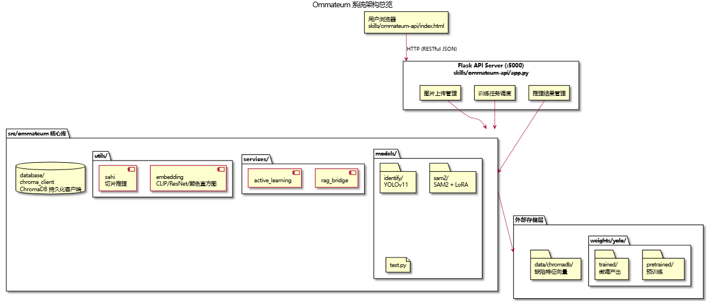
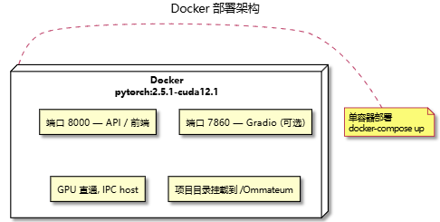
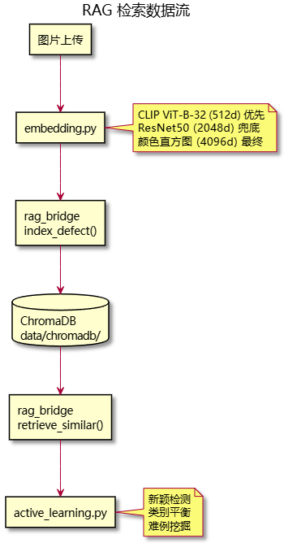
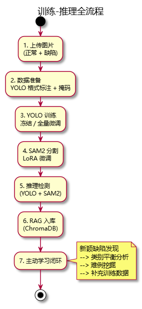

# Ommateum 架构设计报告

> 通用视觉缺陷检测平台 — 架构与模块设计

---

## 一、项目定位

Ommateum 是一个端到端的通用视觉缺陷检测平台，提供从数据上传、模型训练、推理检测到结果管理的完整工作流。核心能力包括：

- **缺陷检测** — 基于 YOLOv11 的目标检测，输出边界框与类别
- **缺陷分割** — 基于 SAM2 的像素级掩码生成，LoRA/QLoRA 参数高效微调
- **RAG 缺陷检索** — ChromaDB 向量库持久化缺陷特征，支持相似检索与主动学习
- **RESTful API** — 完整的模型管理、训练、推理接口，可集成任意前端
- **Web 前端** — 单文件 HTML 界面，零构建步骤

---

## 二、系统架构总览



> PUML 源文件：[system-architecture.puml](umls/codes/system-architecture.puml)

**部署方式：**



> PUML 源文件：[deployment.puml](umls/codes/deployment.puml)

---

## 三、模块详解

### 3.1 检测模块 — YOLOv11 (`models/identify/`)

| 文件 | 职责 |
|---|---|
| `train.py` | `train_yolo_model()` — 全量微调 / 冻结 backbone 训练。小样本最佳实践：freeze=20, lr0=0.001, cosine LR, 关闭强数据增强 |
| `evaluate.py` | 在验证集上计算 mAP 等指标 |
| `generate_result.py` | 对单张/批量图片执行推理，输出边界框与置信度 |

**训练策略：**
- 默认冻结 backbone+neck（`freeze=20`），仅训练检测头，防止灾难性遗忘
- 低学习率 + cosine 衰减，小数据集经不起大步长
- 关闭 mosaic/mixup/erasing/randaugment，保留适度 HSV 抖动和翻转
- 验证阶段 NMS IoU 阈值可通过 `--iou` 参数控制（默认 0.7）

---

### 3.2 分割模块 — SAM2 (`models/sam2/`)

| 文件 | 职责 |
|---|---|
| `config.py` | `add_lora_config()` — 在 SAM2 中注入 LoRA/QLoRA 适配器（rank=16, DoRA, 目标 q/v/k/out_proj） |
| `train.py` | `train_sam2()` — 完整训练循环，AdamW 优化器，自定义 Sam2Loss |
| `dataset.py` | `YOLO2SAM2Dataset` — 将 YOLO 标签（bbox）转为 SAM2 的 prompt 格式 |
| `loss.py` | Sam2Loss — 组合 Focal(×20) + Dice(×1) + IoU(×1) |
| `test.py` | 在验证集上评估分割 mIoU |

**设计考量：**
- 使用 PEFT（LoRA/QLoRA）而非全量微调，大幅降低显存占用
- QLoRA 选项（`use_quant=True`）支持 4-bit 量化，进一步降低硬件门槛
- 损失函数三路并行：Focal 处理类别不平衡，Dice 监督区域重叠，IoU 校准置信度

---

### 3.3 RAG 检索 — ChromaDB + CLIP (`services/` + `database/`)



> PUML 源文件：[rag-pipeline.puml](umls/codes/rag-pipeline.puml)

**三层 Embedding 自动回退：**

| 方案 | 模型 | 维度 | 说明 |
|---|---|---|---|
| 优先 | CLIP ViT-B-32 | 512 | 语义对齐最优，跨域泛化强 |
| 兜底 | ResNet50 | 2048 | PyTorch 原生，无需额外安装 |
| 最终 | 颜色直方图 | 4096 | 零依赖，保证任何环境可运行 |

**ChromaDB 持久化：**
- 本地文件存储路径：`data/chromadb/`
- 集合名：`defect_samples`
- 元数据字段：图片 ID、缺陷类别、时间戳、误检标记

**主动学习策略：**
- `find_novel_defects` — 相似度低于阈值 → 标记为新类型缺陷，建议标注
- `get_underrepresented_labels` — 统计各类别样本量，返回最稀缺类别
- `get_hard_negatives` — 检索高相似度的误检样本，用于难例重训练

---

### 3.4 SAHI 切片推理 (`utils/sahi.py`)

针对高分辨率（如 256×1600 Severstal 钢带）图像，将原图切分成小块分别推理，再合并结果。

| 参数 | 默认值 | 说明 |
|---|---|---|
| `slice_height/width` | 640 | 切片尺寸 |
| `overlap_height/width_ratio` | 0.2 | 相邻切片重叠比例，防止边界漏检 |
| `postprocess_type` | NMS | 合并时去重重叠检测框 |

输出支持 COCO JSON 格式导出。

---

### 3.5 API 服务 (`skills/ommateum-api/`)

| 文件 | 职责 |
|---|---|
| `app.py` | Flask 后端，15 个 RESTful 端点 |
| `index.html` | 单文件前端，原生 HTML+CSS+JS |
| `inference_server.py` | 推理引擎适配层 |

**核心 API 端点：**

| 方法 | 路径 | 说明 |
|---|---|---|
| GET | `/api/models` | 可用模型列表 |
| GET | `/api/weights` | 可用权重列表（含训练产出） |
| POST | `/api/images` | 上传图片（正常/缺陷） |
| POST | `/api/train` | 启动训练任务 |
| GET | `/api/train/{id}` | 查询训练进度与指标 |
| GET | `/api/export/{id}` | 导出训练模型（.omt） |
| POST | `/api/predict` | 执行缺陷检测 |
| GET | `/api/tasks/{id}` | 查询检测结果 |
| GET | `/api/stats` | 数据集统计 |

**前端设计：**
- 单文件零构建，原生 HTML+CSS+JS
- 三个页面（检测配置 / 样本上传 / 结果）以全屏滑动切换
- 训练面板支持高级参数配置，实时进度展示
- 浅色天空蓝主题，CSS 自定义属性设计系统

---

## 四、训练-推理全流程



> PUML 源文件：[training-inference-flow.puml](umls/codes/training-inference-flow.puml)

---

## 五、关键设计决策

| 决策 | 理由 |
|---|---|
| **YOLOv11 冻结 backbone** | 小样本场景（30-shot）下全量微调极易过拟合，冻结预训练主干可稳定收敛 |
| **SAM2 使用 LoRA 而非全量微调** | SAM2 参数量庞大（~数百 M），LoRA 仅训练 ~1% 参数，显著降低显存和时间成本 |
| **ChromaDB 本地持久化** | 无需外部数据库服务，零运维，数据直落文件系统 |
| **CLIP → ResNet → 直方图 三级 Embedding 回退** | 保证从 GPU 服务器到纯 CPU 环境均可运行，不因缺少某个库而崩溃 |
| **SAHI 切片推理** | 针对长宽比极端的高分辨率图像（如 256×1600），直接缩放会丢失小缺陷，切片保持原始分辨率 |
| **单文件 HTML 前端** | 零构建步骤，部署时只需复制一个文件，nginx 静态托管即可 |

---

## 六、目录结构与职责

```
Ommateum/
├── src/ommateum/          # 核心 Python 库
│   ├── models/            # YOLOv11 检测 + SAM2 分割训练与推理
│   ├── services/          # RAG 检索 + 主动学习逻辑
│   ├── utils/             # Embedding 提取 + SAHI 切片推理
│   └── database/          # ChromaDB 持久化客户端
├── scripts/               # 训练 / 评估 / 数据合成的 Shell 与 Python 脚本
├── skills/ommateum-api/   # Flask API 服务 + Web 前端
├── tests/                 # 单元测试
├── docs/                  # 架构与设计文档
├── data/                  # 运行时数据（图片、训练集、ChromaDB）
├── weights/               # 模型权重（预训练 + 微调产出）
├── Dockerfile             # CUDA 12.1 + PyTorch 2.5.1 镜像
└── docker-compose.yml     # GPU 直通单容器部署
```

---

## 七、技术栈

| 层级 | 技术 |
|---|---|
| 检测模型 | Ultralytics YOLOv11 |
| 分割模型 | SAM2 + HuggingFace Transformers + PEFT (LoRA/QLoRA) |
| 向量数据库 | ChromaDB (PersistentClient, 本地文件存储) |
| Embedding | CLIP ViT-B-32 / ResNet50 / 颜色直方图 |
| 后端框架 | Flask + Flask-CORS |
| 前端 | 原生 HTML + CSS + JavaScript |
| 推理优化 | SAHI 切片辅助超推理 |
| 部署 | Docker + nginx + docker-compose |
| 深度学习框架 | PyTorch 2.5.1 + CUDA 12.1 |
